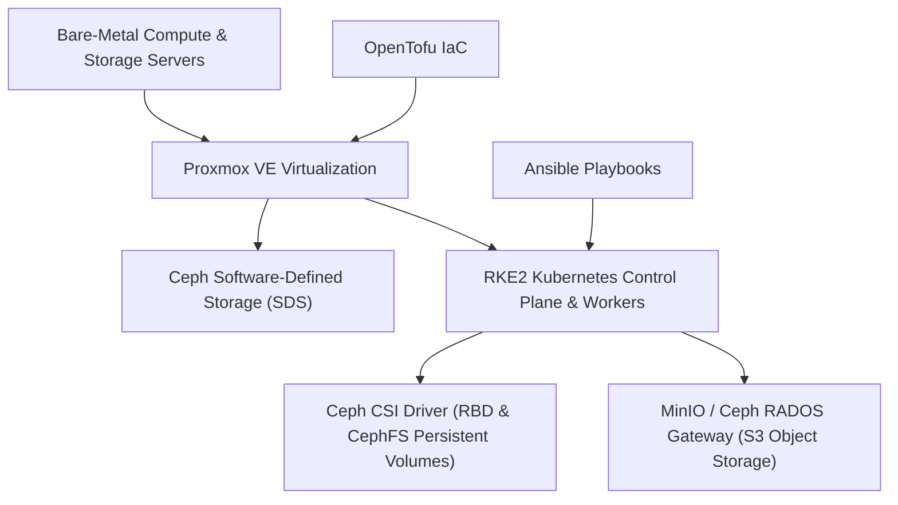

# Sovereign Infrastructure: Proxmox VE, RKE2, Ceph SDS & Automation

The infrastructure foundation delivers high availability, fault tolerance, and absolute data sovereignty through a hyperconverged, open-source stack.

## 🏗️ Infrastructure Stack Layers

## 🛠️ Component Specifications

| Component | License / Type | Primary Function | Operational Advantage |
| :--- | :--- | :--- | :--- |
| **Proxmox VE** | AGPLv3 / Open Source | Type-1 Bare-Metal Hypervisor | Enterprise KVM virtualization without licensing fees. |
| **Ceph SDS** | LGPLv2.1 / Open Source | Distributed Block, File, and S3 Storage | Self-healing, resilient object store powering Lakehouse S3 API. |
| **RKE2** | Apache 2.0 / Open Source | CIS-hardened Kubernetes Engine | FIPS 140-2 compliant container orchestration for BDA microservices. |
| **OpenTofu** | MPL v2.0 / Open Source | Infrastructure as Code (IaC) | Declarative VM and cloud infrastructure provisioning. |
| **Ansible** | GPLv3 / Open Source | Configuration & AIOps | Idempotent cluster bootstrapping, OS hardening, and rollouts. |
