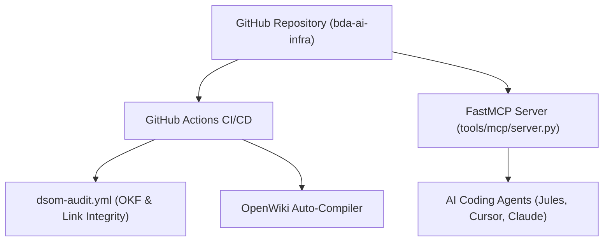

# FastMCP Integration & Continuous Integration Workflows

Automated CI pipelines and Model Context Protocol (MCP) integrations expose SSoT knowledge directly to human operators and AI agents.

## 🔌 MCP & CI Pipeline Architecture

## ⚙️ Automated Workflows

1. **`dsom-audit.yml`:** Audits OKF v0.2 YAML frontmatter headers, verifies zero dead links, and runs `pytest`.
2. **`openwiki_emulator.py`:** Generates and validates the entire `openwiki/` knowledge graph and offline standalone HTML visualizer.
