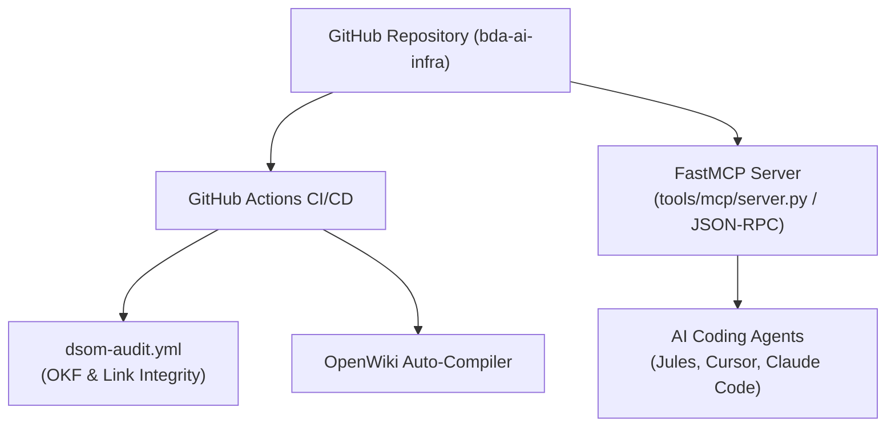

# FastMCP Integration & Continuous Integration Workflows

Automated CI pipelines and Model Context Protocol (MCP) integrations expose SSoT knowledge directly to human operators and AI agents.

## 🔌 MCP & CI Pipeline Architecture

### Dual-Render Architecture Specification: MCP & CI Pipeline Architecture

#### 1. Standalone Production-Ready SVG Vector Graphic (`.svg`)

```xml
<svg xmlns="http://www.w3.org/2000/svg" viewBox="0 0 900 360" width="100%" height="100%">
  <defs>
    <marker id="arrow-mcp" viewBox="0 0 10 10" refX="6" refY="5" markerWidth="6" markerHeight="6" orient="auto-start-reverse">
      <path d="M 0 0 L 10 5 L 0 10 z" fill="#475569" />
    </marker>
  </defs>

  <rect width="900" height="360" fill="#F8FAFC" rx="10"/>

  <rect x="20" y="20" width="220" height="320" fill="#FFFFFF" stroke="#CBD5E1" stroke-width="1.5" rx="8"/>
  <rect x="20" y="20" width="220" height="30" fill="#EFF6FF" rx="8"/>
  <text x="30" y="40" font-family="-apple-system, BlinkMacSystemFont, 'Segoe UI', Roboto, sans-serif" font-size="12" font-weight="bold" fill="#1E40AF">SOURCE CODE REPO</text>
  <rect x="35" y="110" width="190" height="100" fill="#F8FAFC" stroke="#E2E8F0" rx="6"/>
  <text x="45" y="135" font-family="-apple-system, BlinkMacSystemFont, 'Segoe UI', Roboto, sans-serif" font-size="12" font-weight="bold" fill="#0F172A">GitHub Repository</text>
  <text x="45" y="155" font-family="Consolas, Monaco, monospace" font-size="10" fill="#2563EB">bda-ai-infra</text>

  <rect x="280" y="20" width="280" height="320" fill="#FFFFFF" stroke="#CBD5E1" stroke-width="1.5" rx="8"/>
  <rect x="280" y="20" width="280" height="30" fill="#DCFCE7" rx="8"/>
  <text x="290" y="40" font-family="-apple-system, BlinkMacSystemFont, 'Segoe UI', Roboto, sans-serif" font-size="12" font-weight="bold" fill="#166534">CI/CD &amp; FASTMCP SERVER</text>
  <rect x="295" y="70" width="250" height="70" fill="#F8FAFC" stroke="#E2E8F0" rx="6"/>
  <text x="305" y="92" font-family="-apple-system, BlinkMacSystemFont, 'Segoe UI', Roboto, sans-serif" font-size="12" font-weight="bold" fill="#0F172A">GitHub Actions CI/CD</text>
  <text x="305" y="112" font-family="Consolas, Monaco, monospace" font-size="10" fill="#059669">dsom-audit.yml &amp; OpenWiki</text>
  <rect x="295" y="180" width="250" height="80" fill="#F8FAFC" stroke="#A7F3D0" rx="6"/>
  <text x="305" y="205" font-family="-apple-system, BlinkMacSystemFont, 'Segoe UI', Roboto, sans-serif" font-size="12" font-weight="bold" fill="#065F46">FastMCP Server</text>
  <text x="305" y="225" font-family="Consolas, Monaco, monospace" font-size="10" fill="#047857">tools/mcp/server.py</text>

  <rect x="600" y="20" width="270" height="320" fill="#FFFFFF" stroke="#CBD5E1" stroke-width="1.5" rx="8"/>
  <rect x="600" y="20" width="270" height="30" fill="#FEF3C7" rx="8"/>
  <text x="610" y="40" font-family="-apple-system, BlinkMacSystemFont, 'Segoe UI', Roboto, sans-serif" font-size="12" font-weight="bold" fill="#92400E">SOVEREIGN AI AGENTS</text>
  <rect x="615" y="120" width="240" height="100" fill="#F8FAFC" stroke="#FDE68A" rx="6"/>
  <text x="625" y="145" font-family="-apple-system, BlinkMacSystemFont, 'Segoe UI', Roboto, sans-serif" font-size="12" font-weight="bold" fill="#0F172A">AI Coding Agents</text>
  <text x="625" y="165" font-family="Consolas, Monaco, monospace" font-size="10" fill="#D97706">Jules, Cursor, Claude Code</text>

  <line x1="225" y1="160" x2="295" y2="105" stroke="#475569" stroke-width="1.5" marker-end="url(#arrow-mcp)"/>
  <line x1="225" y1="160" x2="295" y2="220" stroke="#475569" stroke-width="1.5" marker-end="url(#arrow-mcp)"/>
  <line x1="545" y1="220" x2="615" y2="170" stroke="#475569" stroke-width="1.5" marker-end="url(#arrow-mcp)"/>
</svg>
```

#### 2. Git-Native Mermaid Diagram (`.mmd`)



#### 3. Summary Interface & Routing Table

| Source Component | Target Component | Port / Protocol / API Ingress | Security Boundary / Trust Zone / Access Key | Operational Significance / Flow Description |
| :--- | :--- | :--- | :--- | :--- |
| **GitHub Repository** | **GitHub Actions CI/CD** | Git Push Event / Webhook | GitHub Runner Sandbox | Triggers `dsom-audit.yml` workflow for OKF frontmatter, link integrity, and pytest execution. |
| **OpenWiki Auto-Compiler** | **openwiki/ Directory** | Local Python Script (`tools/openwiki_emulator.py`) | Local Build / CI Environment | Generates and compiles OpenWiki documentation pages and standalone HTML knowledge graph. |
| **FastMCP Server** | **AI Coding Agents** | Stdio / JSON-RPC 2.0 | Local Agent Sandbox | Serves SSoT schema context, data contracts, and catalog metadata to AI coding agents. |

## ⚙️ Automated Workflows

1. **`dsom-audit.yml`:** Audits OKF v0.2 YAML frontmatter headers, verifies zero dead links, and runs `pytest`.
2. **`openwiki_emulator.py`:** Generates and validates the entire `openwiki/` knowledge graph and offline standalone HTML visualizer.
