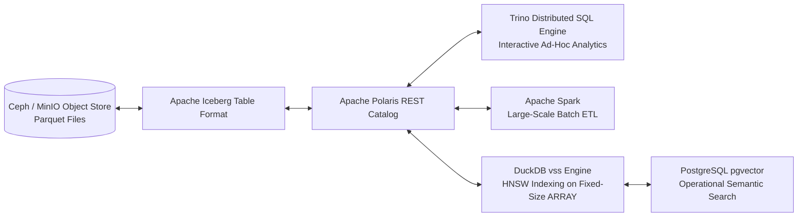

# Query Engines & Lakehouse Storage: Trino, Spark, DuckDB & Iceberg

The analytics core relies on high-performance compute and query engines decoupled from columnar object storage.

## ⚡ Query & Compute Architecture

## 📊 Software Engine Capabilities

- **Trino (Apache 2.0):** Distributed SQL query engine executing interactive ad-hoc queries across petabytes of Iceberg tables via the Polaris REST catalog without data copying.
- **Apache Spark (Apache 2.0):** Unified analytics engine for large-scale batch data processing, streaming ETL, and Iceberg table commits via Polaris REST API.
- **Apache Polaris (Apache 2.0):** Multi-engine open-source Iceberg REST catalog providing centralized RBAC, credential vending, and transaction commit arbitration.
- **DuckDB `vss` (MIT):** In-process OLAP database engine with `vss` vector similarity search; materializes Parquet into tables with fixed-size `ARRAY` columns before building HNSW indexes.
- **PostgreSQL `pgvector` (PostgreSQL):** Operational vector store providing persistent HNSW vector similarity search for high-concurrency API portals and OpenMetadata semantic search.
- **Apache Iceberg (Apache 2.0):** High-performance open table format providing ACID transactions, time travel queries, and schema evolution.
