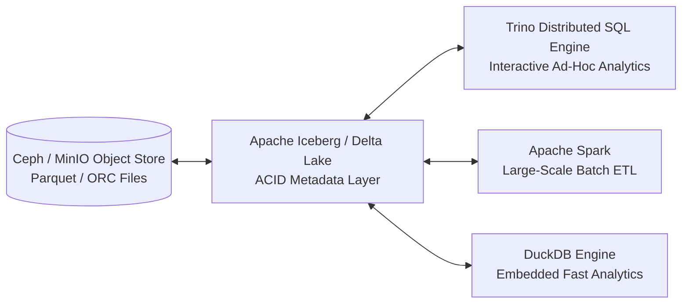

# Query Engines & Lakehouse Storage: Trino, Spark, DuckDB & Iceberg

The analytics core relies on high-performance compute and query engines decoupled from columnar object storage.

## ⚡ Query & Compute Architecture

## 📊 Software Engine Capabilities

- **Trino (Apache 2.0):** Distributed SQL query engine capable of running interactive ad-hoc queries (sub-second on cached/in-memory workloads depending on cluster sizing) across petabytes of Iceberg/Parquet data with zero data movement (querying data in place without copying data into proprietary database formats).
- **Apache Spark (Apache 2.0):** Unified analytics engine for large-scale data processing, streaming ETL, and graph computation.
- **DuckDB (MIT):** In-process SQL OLAP database engine optimized for fast local memory processing and vector analytics.
- **Apache Iceberg (Apache 2.0):** High-performance open table format for huge analytic datasets providing ACID transactions, time travel queries, and schema evolution.
