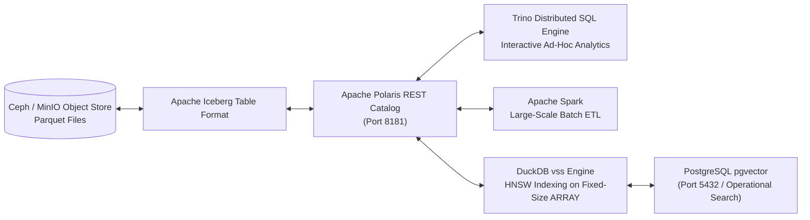

# Query Engines & Lakehouse Storage: Trino, Spark, DuckDB & Iceberg

The analytics core relies on high-performance compute and query engines decoupled from columnar object storage.

## ⚡ Query & Compute Architecture

### Dual-Render Architecture Specification: Query & Compute Architecture

#### 1. Standalone Production-Ready SVG Vector Graphic (`.svg`)

```xml
<svg xmlns="http://www.w3.org/2000/svg" viewBox="0 0 950 360" width="100%" height="100%">
  <defs>
    <marker id="arrow-eng" viewBox="0 0 10 10" refX="6" refY="5" markerWidth="6" markerHeight="6" orient="auto-start-reverse">
      <path d="M 0 0 L 10 5 L 0 10 z" fill="#475569" />
    </marker>
  </defs>

  <rect width="950" height="360" fill="#F8FAFC" rx="10"/>

  <rect x="20" y="20" width="200" height="320" fill="#FFFFFF" stroke="#CBD5E1" stroke-width="1.5" rx="8"/>
  <rect x="20" y="20" width="200" height="30" fill="#F1F5F9" rx="8"/>
  <text x="30" y="40" font-family="-apple-system, BlinkMacSystemFont, 'Segoe UI', Roboto, sans-serif" font-size="12" font-weight="bold" fill="#334155">1. S3 OBJECT STORAGE</text>
  <rect x="35" y="110" width="170" height="100" fill="#F8FAFC" stroke="#E2E8F0" rx="6"/>
  <text x="45" y="135" font-family="-apple-system, BlinkMacSystemFont, 'Segoe UI', Roboto, sans-serif" font-size="12" font-weight="bold" fill="#0F172A">Ceph / MinIO S3</text>
  <text x="45" y="155" font-family="Consolas, Monaco, monospace" font-size="10" fill="#475569">Port 9000 / Parquet</text>

  <rect x="240" y="20" width="220" height="320" fill="#FFFFFF" stroke="#CBD5E1" stroke-width="1.5" rx="8"/>
  <rect x="240" y="20" width="220" height="30" fill="#EFF6FF" rx="8"/>
  <text x="250" y="40" font-family="-apple-system, BlinkMacSystemFont, 'Segoe UI', Roboto, sans-serif" font-size="12" font-weight="bold" fill="#1E40AF">2. LAKEHOUSE CATALOG</text>
  <rect x="255" y="70" width="190" height="80" fill="#F8FAFC" stroke="#E2E8F0" rx="6"/>
  <text x="265" y="95" font-family="-apple-system, BlinkMacSystemFont, 'Segoe UI', Roboto, sans-serif" font-size="12" font-weight="bold" fill="#0F172A">Apache Iceberg</text>
  <rect x="255" y="170" width="190" height="80" fill="#F8FAFC" stroke="#A7F3D0" rx="6"/>
  <text x="265" y="195" font-family="-apple-system, BlinkMacSystemFont, 'Segoe UI', Roboto, sans-serif" font-size="12" font-weight="bold" fill="#065F46">Polaris REST Catalog</text>

  <rect x="480" y="20" width="220" height="320" fill="#FFFFFF" stroke="#CBD5E1" stroke-width="1.5" rx="8"/>
  <rect x="480" y="20" width="220" height="30" fill="#DCFCE7" rx="8"/>
  <text x="490" y="40" font-family="-apple-system, BlinkMacSystemFont, 'Segoe UI', Roboto, sans-serif" font-size="12" font-weight="bold" fill="#166534">3. COMPUTE ENGINES</text>
  <rect x="495" y="60" width="190" height="60" fill="#F8FAFC" stroke="#E2E8F0" rx="6"/>
  <text x="505" y="82" font-family="-apple-system, BlinkMacSystemFont, 'Segoe UI', Roboto, sans-serif" font-size="12" font-weight="bold" fill="#0F172A">Trino SQL Engine</text>
  <rect x="495" y="130" width="190" height="60" fill="#F8FAFC" stroke="#E2E8F0" rx="6"/>
  <text x="505" y="152" font-family="-apple-system, BlinkMacSystemFont, 'Segoe UI', Roboto, sans-serif" font-size="12" font-weight="bold" fill="#0F172A">Apache Spark</text>
  <rect x="495" y="200" width="190" height="60" fill="#F8FAFC" stroke="#E2E8F0" rx="6"/>
  <text x="505" y="222" font-family="-apple-system, BlinkMacSystemFont, 'Segoe UI', Roboto, sans-serif" font-size="12" font-weight="bold" fill="#0F172A">DuckDB vss</text>

  <rect x="720" y="20" width="210" height="320" fill="#FFFFFF" stroke="#CBD5E1" stroke-width="1.5" rx="8"/>
  <rect x="720" y="20" width="210" height="30" fill="#FEF3C7" rx="8"/>
  <text x="730" y="40" font-family="-apple-system, BlinkMacSystemFont, 'Segoe UI', Roboto, sans-serif" font-size="12" font-weight="bold" fill="#92400E">4. OPERATIONAL VECTOR</text>
  <rect x="735" y="110" width="180" height="100" fill="#F8FAFC" stroke="#A7F3D0" rx="6"/>
  <text x="745" y="135" font-family="-apple-system, BlinkMacSystemFont, 'Segoe UI', Roboto, sans-serif" font-size="12" font-weight="bold" fill="#065F46">pgvector Store</text>
  <text x="745" y="155" font-family="Consolas, Monaco, monospace" font-size="10" fill="#047857">Port 5432 / HNSW</text>

  <line x1="205" y1="160" x2="255" y2="110" stroke="#475569" stroke-width="1.5" marker-end="url(#arrow-eng)"/>
  <line x1="445" y1="210" x2="495" y2="90" stroke="#475569" stroke-width="1.5" marker-end="url(#arrow-eng)"/>
  <line x1="445" y1="210" x2="495" y2="160" stroke="#475569" stroke-width="1.5" marker-end="url(#arrow-eng)"/>
  <line x1="445" y1="210" x2="495" y2="230" stroke="#475569" stroke-width="1.5" marker-end="url(#arrow-eng)"/>
  <line x1="685" y1="230" x2="735" y2="160" stroke="#475569" stroke-width="1.5" marker-end="url(#arrow-eng)"/>
</svg>
```

#### 2. Git-Native Mermaid Diagram (`.mmd`)



#### 3. Summary Interface & Routing Table

| Source Component | Target Component | Port / Protocol / API Ingress | Security Boundary / Trust Zone / Access Key | Operational Significance / Flow Description |
| :--- | :--- | :--- | :--- | :--- |
| **Ceph / MinIO Storage** | **Apache Iceberg** | `TCP 9000` / S3 REST API | Storage Zone -> Lakehouse Layer | Stores columnar Parquet data files under Apache Iceberg table format metadata. |
| **Trino / Spark / DuckDB** | **Apache Polaris** | `TCP 8181` / REST | Compute Zone -> Catalog Layer | Resolves ACID commits and obtains temporary S3 access credentials for Parquet scans. |
| **DuckDB vss** | **pgvector Store** | `TCP 5432` / PostgreSQL TLS | Compute Zone -> Operational DB | Synchronizes analytical embeddings into persistent PostgreSQL HNSW vector indexes. |

## 📊 Software Engine Capabilities

- **Trino (Apache 2.0):** Distributed SQL query engine executing interactive ad-hoc queries across petabytes of Iceberg tables via the Polaris REST catalog without data copying.
- **Apache Spark (Apache 2.0):** Unified analytics engine for large-scale batch data processing, streaming ETL, and Iceberg table commits via Polaris REST API.
- **Apache Polaris (Apache 2.0):** Multi-engine open-source Iceberg REST catalog providing centralized RBAC, credential vending, and transaction commit arbitration.
- **DuckDB `vss` (MIT):** In-process OLAP database engine with `vss` vector similarity search; materializes Parquet into tables with fixed-size `ARRAY` columns before building HNSW indexes.
- **PostgreSQL `pgvector` (PostgreSQL):** Operational vector store providing persistent HNSW vector similarity search for high-concurrency API portals and OpenMetadata semantic search.
- **Apache Iceberg (Apache 2.0):** High-performance open table format providing ACID transactions, time travel queries, and schema evolution.
