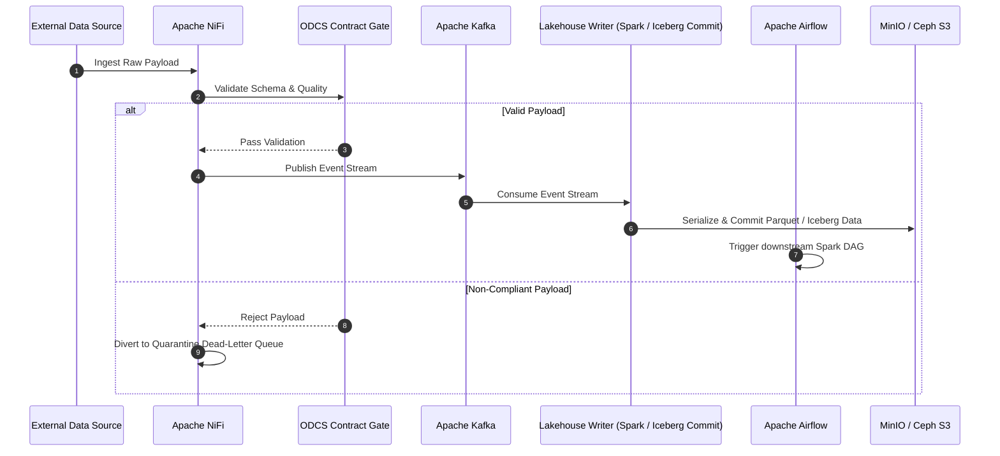

# Data Ingestion & Pipeline Orchestration: NiFi, Kafka, Airflow & ODCS

Data ingestion converts fragmented external data into structured, validated SSoT streams.

## 🔄 Ingestion & Lineage Pipeline Flow

## 🛠️ Open-Source Components

- **Apache NiFi (Apache 2.0):** Visual flow manager for automated data ingestion, protocol transformation, and backpressure handling.
- **Apache Kafka (Apache 2.0):** High-throughput distributed event streaming platform handling real-time data feeds.
- **Apache Airflow (Apache 2.0):** Declarative Python DAG orchestrator coordinating batch processing jobs and monitoring dependencies.
- **Bitol ODCS v3.1.0 (Apache 2.0):** Machine-readable open data contract standard enforcing strict schema validation at ingestion gates.
