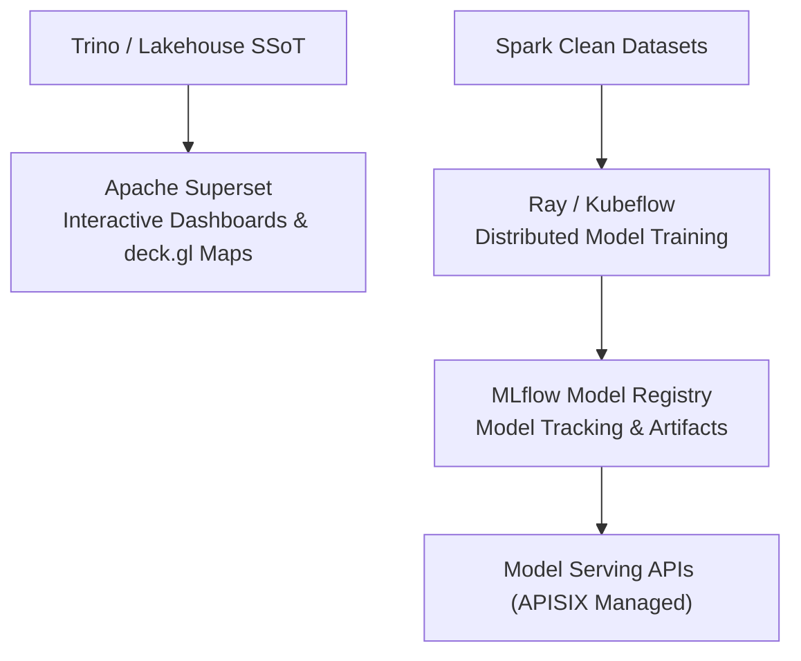

# Business Intelligence & MLOps Solutions: Superset, MLflow & Ray

Analytical applications provide intuitive decision-support interfaces and scalable AI model lifecycle management.

## 📈 BI & Machine Learning Lifecycle

## 📊 Solution Highlights

- **Apache Superset (Apache 2.0):** Modern enterprise Business Intelligence platform with horizontally scalable user concurrency (tested across 4 application worker nodes with 15–20% headroom), native Trino connectivity, SQL Lab, deck.gl spatial analytics, and granular RLS.
- **MLflow (Apache 2.0):** Open-source platform for managing the end-to-end machine learning lifecycle, including experiment tracking, model registry, and evaluation metrics.
- **Ray (Apache 2.0) & Kubeflow (Apache 2.0):** Distributed AI execution framework powering scalable model training, hyperparameter tuning, and orchestration on Kubernetes (RKE2).
