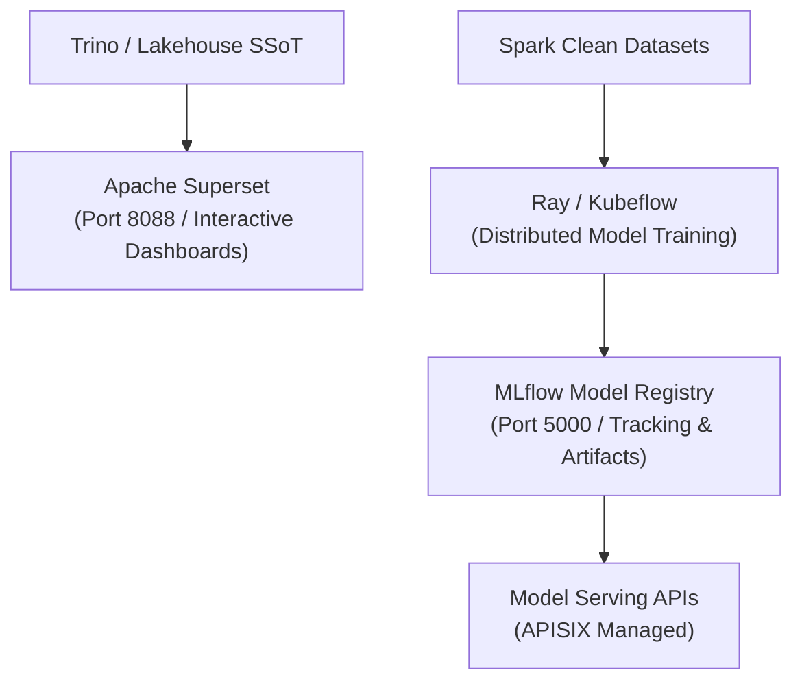

# Business Intelligence & MLOps Solutions: Superset, MLflow & Ray

Analytical applications provide intuitive decision-support interfaces and scalable AI model lifecycle management.

## 📈 BI & Machine Learning Lifecycle

### Dual-Render Architecture Specification: BI & Machine Learning Lifecycle

#### 1. Standalone Production-Ready SVG Vector Graphic (`.svg`)

<svg xmlns="http://www.w3.org/2000/svg" viewBox="0 0 950 360" width="100%" height="100%">
  <defs>
    <marker id="arrow-sol" viewBox="0 0 10 10" refX="6" refY="5" markerWidth="6" markerHeight="6" orient="auto-start-reverse">
      <path d="M 0 0 L 10 5 L 0 10 z" fill="#64748B" />
    </marker>
  </defs>

  <rect width="950" height="360" fill="#0F172A" rx="10"/>

  <rect x="20" y="20" width="280" height="320" fill="#1E293B" stroke="#334155" stroke-width="1.5" rx="8"/>
  <rect x="20" y="20" width="280" height="30" fill="#0F172A" rx="8"/>
  <text x="30" y="40" font-family="-apple-system, BlinkMacSystemFont, 'Segoe UI', Roboto, sans-serif" font-size="12" font-weight="bold" fill="#60A5FA">DATA ASSETS</text>
  <rect x="35" y="80" width="250" height="80" fill="#0F172A" stroke="#334155" rx="6"/>
  <text x="45" y="105" font-family="-apple-system, BlinkMacSystemFont, 'Segoe UI', Roboto, sans-serif" font-size="12" font-weight="bold" fill="#F8FAFC">Trino / Lakehouse SSoT</text>
  <rect x="35" y="180" width="250" height="80" fill="#0F172A" stroke="#334155" rx="6"/>
  <text x="45" y="205" font-family="-apple-system, BlinkMacSystemFont, 'Segoe UI', Roboto, sans-serif" font-size="12" font-weight="bold" fill="#F8FAFC">Spark Clean Datasets</text>

  <rect x="340" y="20" width="280" height="320" fill="#1E293B" stroke="#334155" stroke-width="1.5" rx="8"/>
  <rect x="340" y="20" width="280" height="30" fill="#0F172A" rx="8"/>
  <text x="350" y="40" font-family="-apple-system, BlinkMacSystemFont, 'Segoe UI', Roboto, sans-serif" font-size="12" font-weight="bold" fill="#4ADE80">ANALYTICS &amp; MODEL TRAINING</text>
  <rect x="355" y="80" width="250" height="80" fill="#0F172A" stroke="#334155" rx="6"/>
  <text x="365" y="105" font-family="-apple-system, BlinkMacSystemFont, 'Segoe UI', Roboto, sans-serif" font-size="12" font-weight="bold" fill="#F8FAFC">Apache Superset</text>
  <text x="365" y="125" font-family="Consolas, Monaco, monospace" font-size="10" fill="#60A5FA">Port 8088 / deck.gl</text>
  <rect x="355" y="180" width="250" height="80" fill="#0F172A" stroke="#334155" rx="6"/>
  <text x="365" y="205" font-family="-apple-system, BlinkMacSystemFont, 'Segoe UI', Roboto, sans-serif" font-size="12" font-weight="bold" fill="#F8FAFC">Ray &amp; Kubeflow</text>
  <text x="365" y="225" font-family="Consolas, Monaco, monospace" font-size="10" fill="#4ADE80">Distributed Training</text>

  <rect x="660" y="20" width="270" height="320" fill="#1E293B" stroke="#334155" stroke-width="1.5" rx="8"/>
  <rect x="660" y="20" width="270" height="30" fill="#0F172A" rx="8"/>
  <text x="670" y="40" font-family="-apple-system, BlinkMacSystemFont, 'Segoe UI', Roboto, sans-serif" font-size="12" font-weight="bold" fill="#FBBF24">MLOPS REGISTRY &amp; INFERENCE</text>
  <rect x="675" y="80" width="240" height="80" fill="#0F172A" stroke="#F59E0B" rx="6"/>
  <text x="685" y="105" font-family="-apple-system, BlinkMacSystemFont, 'Segoe UI', Roboto, sans-serif" font-size="13" font-weight="bold" fill="#F8FAFC">MLflow Model Registry</text>
  <text x="685" y="125" font-family="Consolas, Monaco, monospace" font-size="10" fill="#FBBF24">Port 5000 / Tracking / Registry API</text>

  <rect x="675" y="180" width="240" height="80" fill="#0F172A" stroke="#334155" rx="6"/>
  <text x="685" y="205" font-family="-apple-system, BlinkMacSystemFont, 'Segoe UI', Roboto, sans-serif" font-size="12" font-weight="bold" fill="#F8FAFC">Model Serving APIs</text>
  <text x="685" y="225" font-family="Consolas, Monaco, monospace" font-size="10" fill="#60A5FA">APISIX Managed</text>

  <line x1="285" y1="120" x2="355" y2="120" stroke="#64748B" stroke-width="1.5" marker-end="url(#arrow-sol)"/>
  <line x1="285" y1="220" x2="355" y2="220" stroke="#64748B" stroke-width="1.5" marker-end="url(#arrow-sol)"/>
  <line x1="605" y1="220" x2="675" y2="120" stroke="#64748B" stroke-width="1.5" marker-end="url(#arrow-sol)"/>
  <line x1="795" y1="160" x2="795" y2="180" stroke="#64748B" stroke-width="1.5" marker-end="url(#arrow-sol)"/>
</svg>

#### 2. Git-Native Mermaid Diagram (`.mmd`)

#### 3. Summary Interface & Routing Table

| Source Component | Target Component | Port / Protocol / API Ingress | Security Boundary / Trust Zone / Access Key | Operational Significance / Flow Description |
| :--- | :--- | :--- | :--- | :--- |
| **Apache Superset** | **Trino Engine** | `TCP 8080` / SQL REST | BI Portal -> Trust Zone | Connects to Trino query gateway to execute interactive analytical queries. |
| **Ray / Kubeflow** | **MLflow Registry** | `TCP 5000` / HTTP REST | Training Sandbox -> Model Registry | Registers trained model artifacts, metrics, and parameters into central repository. |
| **MLflow Registry** | **APISIX Gateway** | `TCP 443` / HTTPS | Model Registry -> APISIX Gateway | Exposes versioned ML model inference endpoints behind APISIX security policy. |

## 📊 Solution Highlights

- **Apache Superset (Apache 2.0):** Modern enterprise Business Intelligence platform with horizontally scalable user concurrency (tested across 4 application worker nodes with 15–20% headroom), native Trino connectivity, SQL Lab, deck.gl spatial analytics, and granular RLS.
- **MLflow (Apache 2.0):** Open-source platform for managing the end-to-end machine learning lifecycle, including experiment tracking, model registry, and evaluation metrics.
- **Ray (Apache 2.0) & Kubeflow (Apache 2.0):** Distributed AI execution framework powering scalable model training, hyperparameter tuning, and orchestration on Kubernetes (RKE2).
